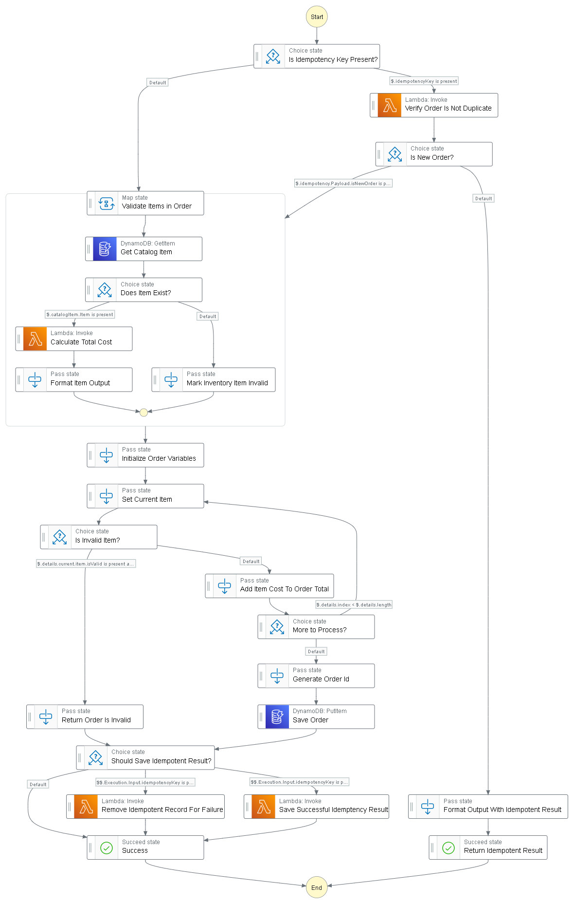

# Serverless Idempotency Reference Architecture

This is a reference architecture on building an idempotent solution using the managed serverless caching solution [Momento](https://www.gomomento.com/). This solution prevents duplicate requests from being processed in the system when an `idempotency-key` header is provided.

## Solution

This project deploys an API that allows users to manage goats and products associated with them like milk, soap, and cheese. Users can place an order to purchase items from the goat catalog.

There are two idempotent endpoints in this API:

```
POST /goats
POST /orders
```

If you attempt to add duplicate goats or orders that share the same idempotency key, you will get one of three results:

* **Identical response** - If a duplicate request comes in that shares the same `idempotency-key` as a request that completed successfully, the response will be identical to the original.
* **Error** - If a duplicate request comes in that shares the same `idempotency-key` but the payload does not match, you will receive a `400 Bad Request` and a message stating the payloads to not match
* **Accepted** - If a duplicate request comes in that shares the same `idempotency-key` while the original is still processing, you will receive a `202 Accepted` and a message stating the original is still processing. This does not result in duplicate work, the endpoint aborts execution immediately to save resources.

## Deployment

To deploy this into your account, you must have the [SAM CLI](https://docs.aws.amazon.com/serverless-application-model/latest/developerguide/serverless-sam-cli-install.html), [AWS CLI](https://docs.aws.amazon.com/cli/latest/userguide/getting-started-install.html), and the [Momento CLI](https://docs.momentohq.com/docs/getting-started) installed on your machine. 

1. Follow the instructions to [obtain a Momento auth token](https://docs.momentohq.com/docs/getting-started#obtain-an-auth-token)
2. Run the command `sam build` from a terminal in the root directory
3. Run the command `sam deploy --guided` and follow the prompts
4. When asked to provide the **MomentoAuthToken**, use the value obtained in step 1

This will deploy the solution into the AWS account configured under your default profile.

## Usage

Once deployed a `BaseUrl` output will display in your terminal with the url to your API. Use the endpoints defined in the [API Spec](./openapi.yaml) to add data into the system.

The API is intended to be a proof of concept for educational purposes, and as a result it is not secured by an auth mechanism. So you can immediately hit your API via a tool like [Postman](https://www.postman.com).

### Get Idempotent With It

If you wish to test the idempotency components to the application, simply provide the header `idempotency-key` in your requests to the two POSTS mentioned above. If your request is successful, the response will be cached for 60 minutes and will return an identical response when invoked multiple times.

The value provided in the `idempotency-key` header can be whatever you want, it is not restricted to a specific format. If you were to adopt a pattern like this in production, it would be recommended to check the format of the key to prevent collisions.

If a request comes in that results in a failure, the idempotent response **will not be saved**. It is available to change the payload and retry. However, if the request is successful, the response is saved and will be returned on subsequent calls using the same idempotency key.

## AWS Resources

The Goat API is a mixture of endpoints backed by Lambda functions and direct integrations to DynamoDB and an Express Step Function workflow. 

The express workflow uses a few of the [recently released](https://aws.amazon.com/about-aws/whats-new/2022/08/aws-step-functions-14-new-intrinsic-features-process-data-workflows/) intrinsic functions for reference. 

When processing an order, the express step function performs the tasks in this diagram.



If it recognizes the idempotency key, it short circuits execution and returns the idempotent response. 

## Additional Reading

If you are interested to learn more about idempotency, please check out [my blog post](https://readysetcloud.io/blog/allen.helton/api-essentials-idempotency). It covers in detail the tradeoffs you must consider when building an idempotent solution. 

The [AWS Lambda Powertools for Python](https://awslabs.github.io/aws-lambda-powertools-python/latest/utilities/idempotency/) solution covers idempotency exceptionally well. If you are a python user, I highly recommend checking it out.

Idempotency is required as part of a solution that [retries failures automatically](https://www.readysetcloud.io/blog/allen.helton/three-ways-to-retry-failures). If you are building serverless applications, please consider automatic retries if you aren't already. It is also one of the [AWS serverless design principles](https://www.readysetcloud.io/blog/allen.helton/decoding-the-aws-serverless-design-principles).

If you are interested in the caching solution I used, check out [Momento](https://www.gomomento.com). They offer true serverless caching in a space that is otherwise lacking. 